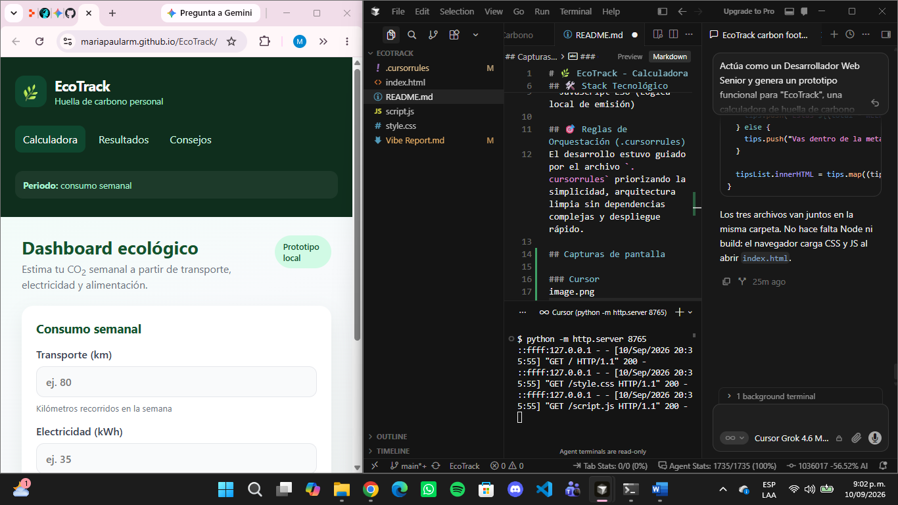

# 🌿 EcoTrack: Clasificador Ambiental con PLN & Vibe Coding

## Autora

**María Paula Rodríguez Muñoz**  
Ingeniera de sistemas en formación 

---

## Descripción

EcoTrack combina dos capas:

1. **Calculadora web de huella de carbono** (HTML5, CSS3, JavaScript ES6): estima CO₂ semanal a partir de transporte (km), electricidad (kWh) y días con consumo de carne.
2. **Clasificador ambiental con PLN** (`clasificador_ambiental.py`): interpreta texto libre en español sobre hábitos y problemas ambientales (transporte, energía, reciclaje, consumo) y lo etiqueta como **Alto Impacto CO2** o **Bajo Impacto / Sostenible**.

El front se abre en el navegador sin build. El módulo de lenguaje natural se ejecuta en Python con NLTK y scikit-learn.

---

## Stack

| Capa | Tecnología |
|------|------------|
| Interfaz | HTML5, CSS3 (variables, Grid/Flexbox, paleta esmeralda), JavaScript ES6 |
| PLN | Python 3, NLTK, scikit-learn (`TfidfVectorizer` + `LogisticRegression` / `MultinomialNB`) |
| Orquestación | Cursor + Replit + GitHub, reglas en `.cursorrules` y copia visible `cursorrules.txt` |

---

## Cómo ejecutar

### Calculadora (web)

Abre `index.html` en el navegador o sirve la carpeta de forma estática:

```bash
python -m http.server 8765
```

Factores de emisión: transporte 0.21 kg CO₂/km, electricidad 0.5 kg CO₂/kWh, carne 2.5 kg CO₂/día.

### Clasificador PLN (consola)

```bash
pip install -r requirements.txt
python clasificador_ambiental.py
```

Prueba en tiempo real (escribe `salir` para terminar):

```text
Hábito > Dejo el auto encendido y viajo solo todos los días
Hábito > Voy en bici, reciclo y como más vegetales
```

También puedes clasificar una frase directa:

```bash
python clasificador_ambiental.py "Separo residuos y uso bombillas LED"
```

---

## Uso de PLN con NLTK y scikit-learn

El archivo `clasificador_ambiental.py` implementa un pipeline clásico de **clasificación de texto supervisada** en español.

### 1. Corpus de entrenamiento

Se construyó un conjunto de frases cortas en español, agrupadas por dominio ambiental:

- **Transporte:** auto particular, vuelos, motor al ralentí vs. bici, metro, trayectos a pie.
- **Energía:** desperdicio eléctrico, calefacción extrema vs. LED, apagado de standby, solar.
- **Reciclaje:** basura mezclada, quema de plástico vs. separación, puntos limpios, compost.
- **Consumo:** carne diaria, empaques de un solo uso, desperdicio de comida vs. granel, segunda mano, dieta con más vegetales.

Cada ejemplo tiene una etiqueta binaria: `Alto Impacto CO2` o `Bajo Impacto / Sostenible`. El objetivo no es un modelo industrial, sino un prototipo didáctico que demuestra el flujo TF-IDF → clasificador.

### 2. Preprocesamiento con NLTK

- **Normalización:** minúsculas y limpieza de signos.
- **Stopwords en español:** `nltk.corpus.stopwords` (se descargan solas si faltan).
- **Stemming:** `SnowballStemmer("spanish")` para unir variantes (`reciclamos` / `reciclar` → misma raíz).
- Tokenizador propio inyectado en el vectorizador, de modo que scikit-learn no dependa del tokenizado por defecto en inglés.

### 3. Representación: `TfidfVectorizer`

TF-IDF convierte cada frase en un vector numérico: palabras (y bigramas) frecuentes en un documento y raras en el corpus pesan más. Así el modelo distingue indicios como *gasolina*, *avión*, *desperdicio* frente a *bicicleta*, *compost*, *LED*.

### 4. Clasificador

El pipeline por defecto usa **`LogisticRegression`** (estable en textos cortos). Se puede cambiar a **`MultinomialNB`** con `entrenar_modelo(usar_naive_bayes=True)`, el enfoque naive Bayes típico de documentos y bags-of-words.

`predict` entrega la categoría; `predict_proba` entrega una **confianza** para explicar el resultado en consola.

### 5. Función ejecutable

`clasificar(texto)` es reutilizable desde otro script. `consola()` abre el bucle interactivo cuando se corre el archivo como programa principal.

Limitación consciente: el modelo solo “conoce” el estilo del dataset de ejemplo. Frases muy irónicas, mezcladas o fuera de dominio pueden bajar la confianza; eso se informa en la lectura del resultado.

---

## Evidencia de integración

Captura del entorno (app EcoTrack, repositorio en GitHub, Cursor y consola local) usada como evidencia del flujo Vibe Coding:



---

## Vibe Report (completo)

**Autora:** María Paula Rodríguez Muñoz  
**Rol:** Ingeniera de sistemas en formación / Arquitecta de Intenciones (Orquestadora de IA)  
**Stack tecnológico:** HTML5, CSS3, JavaScript ES6 (Vanilla) + Python (NLTK, scikit-learn)  
**Ecosistema de desarrollo:** Cursor AI + Replit + GitHub

El desarrollo de EcoTrack (calculadora de huella de carbono personal y clasificador ambiental con PLN) representó una experiencia completa de **Vibe Coding**, donde asumí el rol de orquestadora de IA: lideré las decisiones de diseño, arquitectura y resolución de problemas, y delegué la construcción sintáctica del código a la inteligencia artificial.

Ese paso es el cambio de paradigma de **escritora de sintaxis** a **arquitecta de intenciones**. Ya no el valor principal está en memorizar cada línea, sino en definir restricciones, criterios de calidad y el “vibe” del producto: paleta ecológica, archivos separados, cero frameworks pesados, factores de emisión explícitos y un módulo de PLN auditable. El archivo `.cursorrules` (y su copia visible `cursorrules.txt`) fue el contrato de esa intención: la IA genera, la arquitecta valida y corrige el rumbo.

Desde el inicio, configuré `.cursorrules` para delimitar el sistema. La instrucción clave fue priorizar una arquitectura ligera (HTML5, CSS3 y JavaScript ES6 puro), evitando marcos de trabajo o compiladores pesados. Eso permitió componentes modulares, fáciles de leer y de publicar, con una estética moderna (verdes esmeralda, tipografía sans-serif y tarjetas responsivas). El clasificador en Python se mantuvo **aparte** del front estático, para no romper el despliegue inmediato en el navegador.

El mayor desafío técnico surgió en la integración con Replit y Cursor: agotamiento prematuro de cuotas gratuitas de agentes y restricciones de modelos premium. En lugar de detener el proceso o reescribir todo a mano, apliqué la mentalidad de Vibe Coding: pivoté a modelos alternativos (como Grok) y consolidé una arquitectura estática pura. Esa decisión eliminó dependencias de servidor en la capa web, evitó cuellos de botella de compilación y dejó el código portable hacia GitHub. El PLN se resuelve en consola local con `pip` + `python clasificador_ambiental.py`, sin mezclar Node, Webpack ni Vite.

La orquestación entre **Cursor** (entorno de desarrollo asistido), **Replit** (experimentación y despliegue) y **GitHub** (infraestructura y evidencia pública) demostró que la claridad de la intención y las reglas iniciales permiten superar límites de entorno en poco tiempo: cuotas, archivos ocultos (el `.cursorrules` a veces no se ve en el explorador), y la necesidad de una evidencia visual (`evidencia.png`) que muestre app, IDE y repositorio al mismo tiempo.

EcoTrack no es solo una herramienta para estimar emisiones de CO₂ o etiquetar un hábito en texto libre. Es la evidencia de un flujo de trabajo donde la **dirección de alto nivel** prevalece sobre la codificación manual, y donde la autora actúa como arquitecta de intenciones: diseña el sistema, orquesta las herramientas y responde cuando el entorno se queda corto.

---

## Estructura del repositorio

```text
EcoTrack/
├── index.html
├── style.css
├── script.js
├── clasificador_ambiental.py
├── requirements.txt
├── .cursorrules
├── cursorrules.txt
├── evidencia.png
├── README.md
└── Vibe Report.md
```
